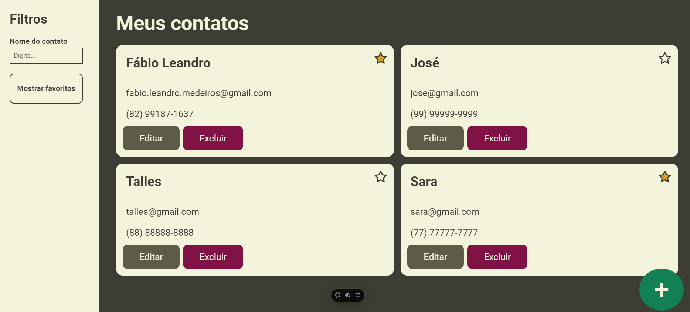

# Agenda de Contatos

## Descrição
A **Agenda de Contatos** é uma aplicação web intuitiva e funcional desenvolvida para facilitar o gerenciamento de seus contatos pessoais ou profissionais. Com ela, é possível cadastrar, visualizar, editar e excluir contatos, armazenando informações essenciais como nome, e-mail e número de telefone. A interface amigável torna a experiência de uso simples e eficiente, permitindo que você organize seus contatos de maneira rápida e prática.



## Funcionalidades
- **Adicionar Contatos:** Cadastre novos contatos com nome, e-mail e telefone.
- **Editar Contatos:** Modifique os detalhes de qualquer contato existente com facilidade.
- **Remover Contatos:** Exclua contatos de forma direta com um clique.
- **Listagem de Contatos:** Visualize todos os contatos cadastrados em uma interface limpa e organizada.

## Tecnologias Utilizadas
- **TypeScript:** Fornece tipagem estática, aumentando a segurança e robustez do código.
- **React:** Utilizado para construir uma interface de usuário reativa e modular.
- **Redux:** Para gerenciamento de estado global, facilitando a manipulação e controle dos dados da aplicação.
- **Styled-components:** Para uma estilização de componentes mais eficiente e intuitiva, utilizando o poder do JavaScript e eliminando a necessidade de arquivos CSS externos.

## Como Executar o Projeto
1. Clone o repositório:
   ```bash
   git clone https://github.com/FabioMedeiros1000/agenda-contatos-react.git
   ```
2. Instale as dependências:
   ```bash
   npm install
   ```
3. Execute o projeto:
   ```bash
   npm start
   ```

## Link da aplicação
[Demonstração](https://agenda-contatos-react-tau.vercel.app/)
